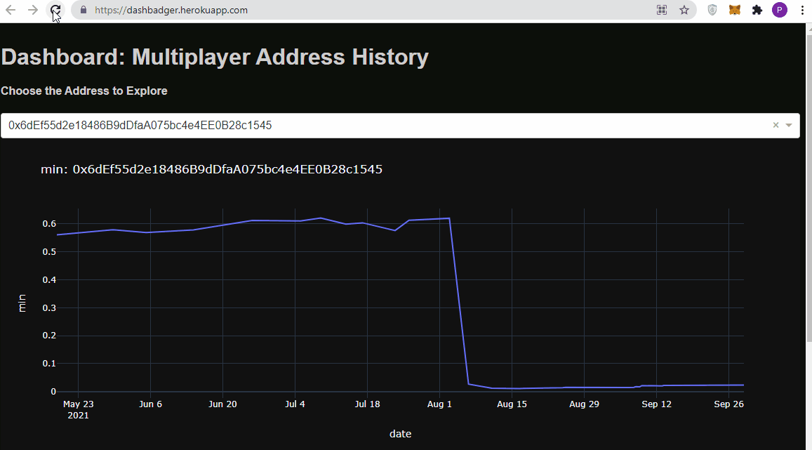

# BadgerVisualization

This project is a submission for [Create Visualization Of Badger Boost Data](https://gitcoin.co/issue/Badger-Finance/gitcoin/27/100026488)

The address multiplier data is hosted on Heroku at https://dashbadger.herokuapp.com/

The analysis of addresses is at https://www.kaggle.com/pavfedotov/badger-address-summary/

## Installation
`pip install -r requirements.txt`

To run the project:

`py main.py`

## Additional Files and Work

Apart from the code in this github repository here is the code for data scrappig and preprocessing:

[The processing of boosts.zip](https://www.kaggle.com/pavfedotov/badger-data/)

[Scrapping of Latest Online date](https://www.kaggle.com/pavfedotov/badger-data?scriptVersionId=75918446)

[Further Visualization of data](https://www.kaggle.com/pavfedotov/visualization-badgers/)

[Full processed dataset](https://www.kaggle.com/pavfedotov/badgerboosts)
